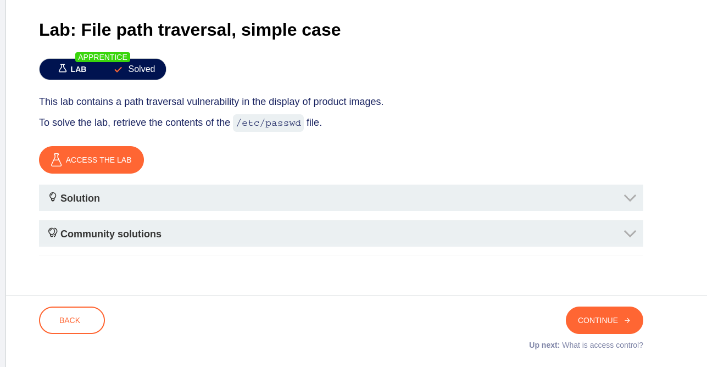
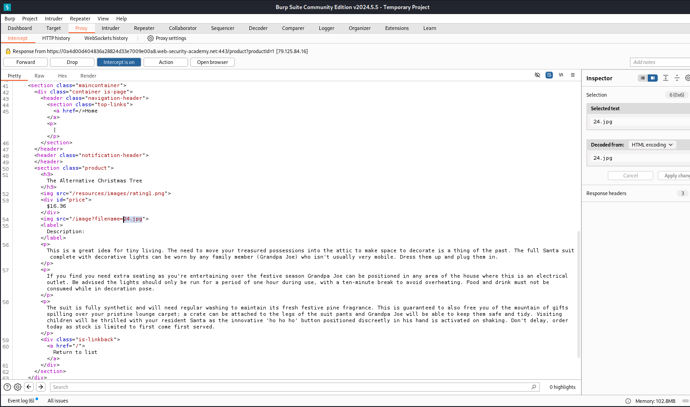
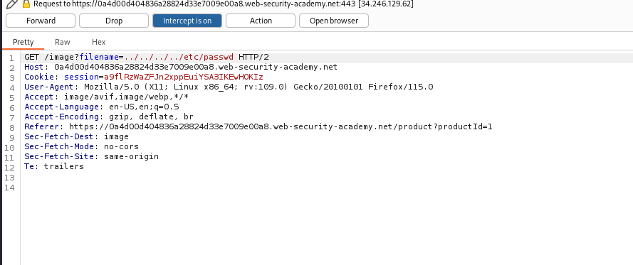
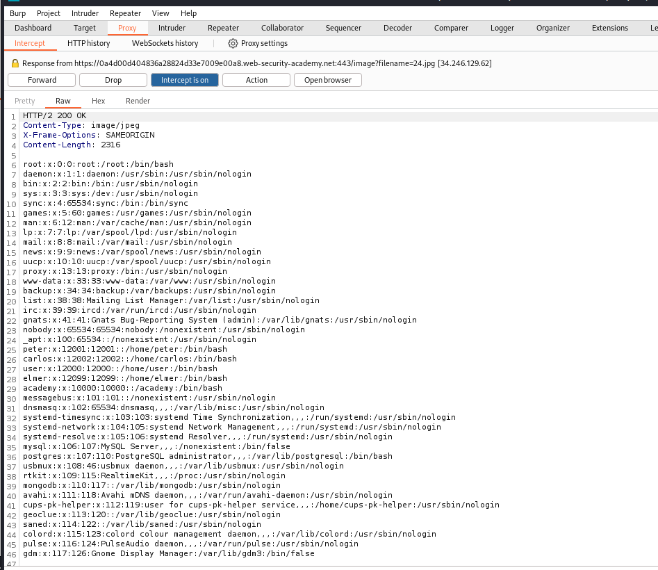

# Lab - File path traversal, simple case

## Goal: retrieve the contents of the /etc/passwd file. 

This is a simple lab where we are introduced to **File Path Traversal**. In the description we're already told where is the location of the vulnerability.

> This lab contains a path traversal vulnerability in the display of product images. 

So if access the lab, we will be introduced to this homepage.

## Steps

1. Based on the description of the lab we should look for the vulnerability in the image. we can select one of the product to see it's product page.

2. Next, we should try capture it in burp. We can see in burp the HTTP request. This is the response when you GET the product page.

Here we can see that the first request to get the content of the product page. But the next one is a HTTP request to get the image.

3. We can try path traversal here.

4. Okay we're done here, we got the content of passwd (the list of users in Linux system).

